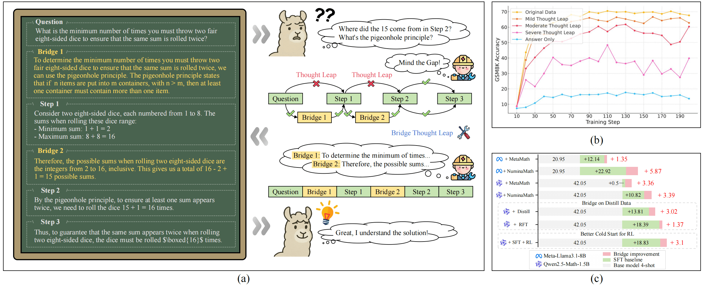
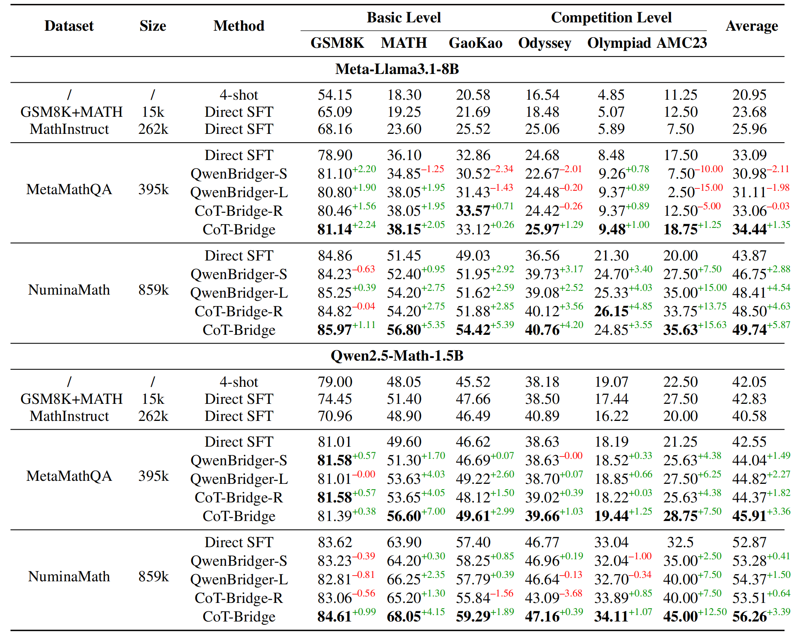
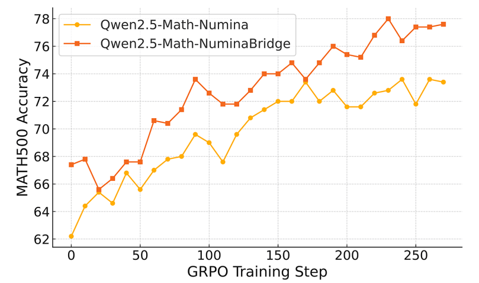

<div align="center">
     <h1>Mind the Gap: Bridging Thought Leap for Improved CoT Tuning</h2>
</div>

<p align="center">
  <strong>Haolei Xu<sup>1*</sup></strong>,  
  Yuchen Yan<sup>1*</sup>,  
  <strong>Yongliang Shen<sup>1†</sup></strong>,  
  Wenqi Zhang<sup>1</sup>,  
  Guiyang Hou<sup>1</sup>,  
  Shengpei Jiang<sup>2</sup>,  
  Kaitao Song<sup>3</sup>,  
  <strong>Weiming Lu<sup>1†</sup></strong>,  
  Jun Xiao<sup>1</sup>,  
  Yueting Zhuang<sup>1</sup>
</p>
<p align="center">
  <sup>1</sup>Zhejiang University  
  <br>
  <sup>2</sup>The Chinese University of Hong Kong  
  <br>
  <sup>3</sup>Microsoft Research Asia  
  <br>
  <em>Preprint. Under review.</em>  
  <br>
  <sup>*</sup>Equal Contribution, <sup>†</sup>Corresponding Author
</p>


<p align="center">
          🤗 <a href="https://huggingface.co/collections/zjuxhl/mind-the-gap-682cb7693b5f51f42162c7e3">Hugging Face</a>
          |  <a href="https://arxiv.org/abs/2505.14684">Arxiv</a> 
          | 📑 <a href="https://zju-real.github.io/CoT-Bridge/">WebPage</a> 
<br>
</p>


<p align="center">

Overview of the Thought Leap phenomenon and our bridging approach. (a) Thought Leaps in CoT; (b) Negative impact on training; (c) Bridging leaps improves reasoning performance.
</p>

## News 🔥🔥
- **2025.05.22:** We release our data, model and code.
- **2025.05.20:** We release our paper.
- **2025.09.18:** Our paper has been accepted by **NeurIPS 2025**.

## Overview 🦾🦾
In this work, we address a critical but underexplored issue in Chain-of-Thought (CoT) reasoning for Large Language Models (LLMs): the presence of *Thought Leaps*—missing intermediate steps that disrupt the coherence and completeness of reasoning chains. These gaps often arise when human experts, relying on implicit knowledge, omit steps they consider trivial. However, such omissions hinder model learning and generalization.

To tackle this challenge, we propose the **CoT Thought Leap Bridge Task**, which automatically detects and fills these missing steps. We build a specialized dataset, **ScaleQM+**, derived from the structured **ScaleQuestMath** dataset, where we systematically introduce Thought Leaps and pair them with complete reasoning chains. Based on this, we develop **CoT-Bridge**, a model trained to detect reasoning gaps and generate the appropriate bridging content.

We demonstrate through extensive experiments that fine-tuning models on bridged datasets leads to significant improvements in mathematical and logical reasoning tasks. Our method enhances distilled data, improves reinforcement learning cold starts, and generalizes well to out-of-domain reasoning benchmarks. Importantly, CoT-Bridge serves as a plug-and-play module that can seamlessly integrate with existing training workflows to amplify performance.

Through this work, we aim to improve the structural integrity of CoT reasoning and contribute to more robust and interpretable LLM-based problem solvers.


Our contributions can be summarized as follows:  
- To the best of our knowledge, we are the first to systematically identify and formalize the **Thought Leap** phenomenon in CoT reasoning. We introduce the **CoT Thought Leap Bridge Task** along with an evaluation framework for addressing this issue.
- We develop a specialized dataset (**ScaleQM+**) and a model (**CoT-Bridge**) for identifying and bridging Thought Leaps, demonstrating their effectiveness through comprehensive experiments.
- We apply **CoT-Bridge** to existing mathematical reasoning datasets, achieving significant performance improvements(**+5.87%**) and demonstrating good generalization capabilities on out-of-domain logical reasoning benchmarks (**+2.99%**).
- We validate that our approach can function as a **plug-and-play enhancement module**, compatible with methods such as **knowledge distillation** (**+3.02%**) and **reinforcement learning** (**+3.1%**), to further amplify model performance.


## QuickStart 🎯🎯
```plaintext
Mind-the-Gap
├── CoT_Thought_Leap_Bridge_Task_Eval  # Apply various bridging methods to the dataset and evaluate on the ScaleQM+ test set
├── PRM                                # Use Qwen2.5Math-PRM-7B to score bridged steps and construct a denoising dataset
├── README.md
├── RL                                 # Evaluate whether our method provides a better cold-start model
├── SFT                                # Train the CoT-Bridge and fine-tune on the mathematical CoT dataset
├── ScaleQM+                           # Scripts for constructing the ScaleQM+ dataset
├── figures
├── logic_eval                         # Evaluation for logic reasoning benchmarks
├── math_eval                          # Evaluation for math reasoning benchmarks
├── readme.md
└── requirements.txt                   # Dependencies for evaluation

```

### 🔧 SFT Training
#### Setup

```bash
cd SFT
# Clone the LLaMA-Factory repository
git clone https://github.com/hiyouga/LLaMA-Factory.git
cd LLaMA-Factory

# Create a new environment
conda create -n llama_factory python=3.10
conda activate llama_factory

# Install core dependencies
pip install -e ".[torch,metrics]"

# For 910B support (Huawei Ascend NPU)
pip install -e ".[torch-npu,metrics]"
pip install -e ".[deepspeed,modelscope]"
```

#### train
```bash
llamafactory-cli train cotbridge.yaml
```
We use eight 910b 64G devices for all SFT training. To fully leverage the performance of the 910b, please refer to the YAML configuration files in the `SFT` directory.

### 🧠 Math & Logic Evaluation
#### Setup
```bash
# Create a new environment for evaluation
conda create -n eval python=3.10
conda activate eval

# Install required packages
pip install -r requirements.txt
```

> ⚠️ **Heads-up:**
> If `math-verify` fails during installation, run:

```bash
pip install "math-verify[antlr4_13_2]"
```


#### Mathematical Benchmark
```bash
cd math_eval
````
To evaluate a single model:
```bash
bash eval.sh
```
To perform batch evaluation:
```bash
bash batch_eval.sh
```
We recommend using **DeepSeek R1** for secondary verification on benchmarks involving complex expressions. **QwQ-32B** is also a viable alternative.

Before running, make sure to add your API key to `api.py`.

Then execute:

```bash
bash r1.sh
```

#### Logic Reasoning Benchmark
Step 1: Perform Reasoning
```bash
bash batch_eval.sh
```
Step 2: Compute Accuracy
We use [`IAAR-Shanghai/xFinder-qwen1505`](https://huggingface.co/IAAR-Shanghai/xFinder-qwen1505) for extracting logic reasoning benchmark answers.
```bash
bash batch_acc.sh
```
#### Result
<p align="center">

</p>


### 🧬 Reinforcement Learning
#### Setup
We modified parts of VERL's code to more conveniently support changes to the reward function and customization of the training prompts.

```bash
conda create -n verl python=3.10
conda activate verl
cd RL/verl
pip install -e .[vllm]
pip install "math-verify[antlr4_9_3]"
pip install swanlab
```
#### GRPO Training
We recommend directly downloading `zjuxhl/Qwen2.5Math1.5B-NuminaMath-bridge` and `zjuxhl/Qwen2.5Math1.5B-NuminaMath` to reproduce the RL experiments.
```bash
bash grpo.sh
```
To merge models
```bash
bash merge.sh
```

#### Results
<p align="center">

</p>

## Citation

If you find our work helpful, feel free to give us a cite.

```
@misc{xu2025mindgapbridgingthought,
      title={Mind the Gap: Bridging Thought Leap for Improved Chain-of-Thought Tuning},
      author={Haolei Xu and Yuchen Yan and Yongliang Shen and Wenqi Zhang and Guiyang Hou and Shengpei Jiang and Kaitao Song and Weiming Lu and Jun Xiao and Yueting Zhuang},
      year={2025},
      eprint={2505.14684},
      archivePrefix={arXiv},
      primaryClass={cs.CL},
      url={https://arxiv.org/abs/2505.14684},
}
```

## Contact Us
If you have any questions, please contact us by email: 
xuhaolei@zju.edu.cn, syl@zju.edu.cn, luwm@zju.edu.cn
